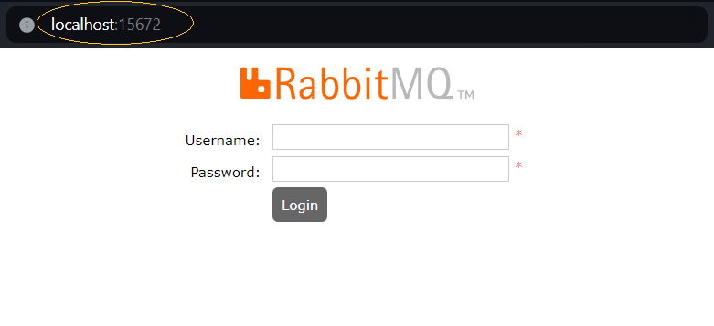
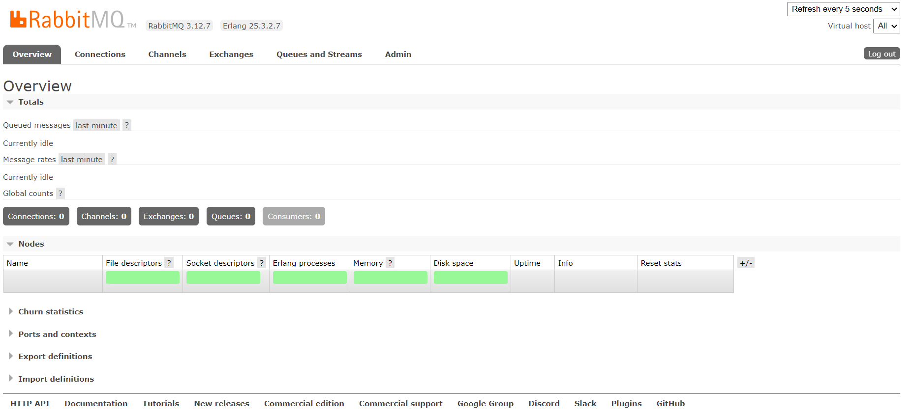

# MusicEvents

## Sobre
Este é um sistema para divulgação de eventos musicais, onde um usuário ADMINISTRADOR cria os eventos e 
outro usuário CLIENTE faz sua inscrição.

Para a interação com o sistema, ambos os usuários precisam se autenticar através de e-mail e senha.
O usuário CLIENTE pode criar sua conta utilizando a página de cadastro e para um melhor aproveitamento, 
um usuário ADMINISTRADOR já foi previamente cadastrado com as seguintes credenciais. 

E-mail: admin@musicevents.com   
Senha: admin123

# Documentação

* [Protótipos](#protótipos)
    * [Tela de login](#tela-de-login)
    * [Tela de cadastro de usuário](#tela-de-cadastro-de-usuário)
    * [Página inicial do administrador](#página-inicial-do-administrador)
    * [Página inicial do cliente](#página-inicial-do-cliente)
* [Arquitetura](#arquitetura)
* [Como executar o projeto](#como-executar-o-projeto)
    * [Clonar o projeto](#1-clonar-o-projeto)
    * [Restaurar o backup do banco de dados](#2-restaurar-o-backup-do-banco-de-dados)
    * [Executar o RabbitMQ](#3-executar-o-rabbitmq)
    * [Executar o projeto](#4-executar-o-projeto)
* [Tecnologias utilizadas](#tecnologias-utilizadas)

# Protótipos
### Tela de login

### Tela de cadastro de usuário

### Página inicial do administrador

### Página inicial do cliente

# Arquitetura
O projeto utiliza uma arquitetura básica de Microsserviços dividindo-se em uma API que controla as funcionalidades básicas da aplicação e um microsserviço que faz o registro de logs, como pode ser observado no seguinte fluxograma.

# Como executar o projeto
### 1. Clonar o projeto
* Para clonar o projeto com o Visual Studio 2022, clique em "Clone a repository", em seguida "GitHub" e entre com as credenciais de sua conta e url do projeto.
* Ao clonar o projeto, deve ser executado o arquivo no diretório "MusicEvent\MusicEvent.sln".

### 2. Restaurar o backup do banco de dados
* Para executar o migration da criação do DB, acesse:
    * "Tools" > "NuGet Package Manager" > "Package Manager Console",
    * Selecione o "Default project: 4. Infrastructure\MusicEvent.Infra.Data" e execute o comando "update-database -context MusicEventContext"
* Para restaurar a base criada no SQL Server Management Studio, clique com o botão direito em:
    * "Databases" > "Restore Database...".
    * Selecione o arquivo na pasta "MusicEvent\SQL\DB_MusicEvent.bak".

### 3. Executar o RabbitMQ
* Instale o Docker na sua máquina
* Após instalar o Docker, utilize o seguinte comando para baixar e executar o RabbitMQ
    * docker run -p 15672:15672 -p 5672:5672 masstransit/rabbitmq
* Em seguida, abra o navegador e acesse o RabbitMQ através da porta 15672 no endereço http://localhost:15672

* Utilize as credenciais padrão do RabbitMQ para acessar o sistema digitando a palavra "guest" em USERNAME e PASSWORD. Sem aspas!
* 

### 4. Executar o projeto
* Para executar o projeto, clique com o botão direito no projeto web "MusicEvent.Web", selecione "Set as Startup Project" e no botão "executar" na parte superior central, selecione "IIS Express" e clique em executar para carregar a página do Swagger.
* Para executar o Front-End(Angular) utilizando o Visual Studio Code:
    *  Clique em "Open Folder..." e selecione a pasta "MusicEvent\MusicEvent.Web\ClientApp".
    *  Em seguida no terminal do Visual Studio Code, execute o comando "npm install" para baixar os pacotes.
    *  Por fim "ng serve -o" para executar a aplicação e abrir a página de login.

# Tecnologias utilizadas
* .NET 7
* EntityFrameworkCore
* SQL Server
* Angular 15
* RabbitMQ
* Docker
