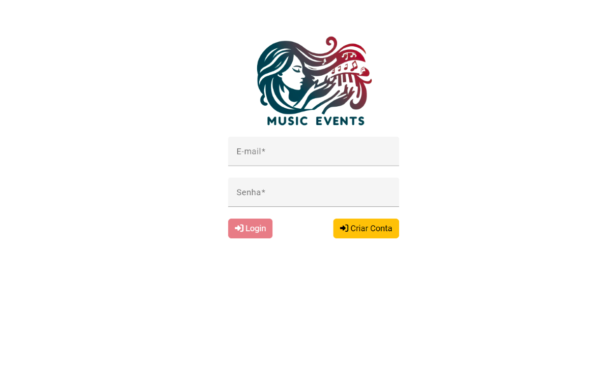

# MusicEvents

## Sobre
Este é um sistema para divulgação de eventos onde um usuário ADMINISTRADOR cria os eventos e 
outro usuário CLIENTE faz sua inscrição nos eventos criados.

Para a interação com o sistema, ambos os usuários precisam se autenticar através de e-mail e senha.
O usuário CLIENTE pode criar sua conta utilizando a página de cadastro e para um melhor aproveitamento, 
um usuário ADMINISTRADOR já foi previamente cadastrado com as seguintes credenciais. 

E-mail: admin@musicevents.com   
Senha: admin123

# Documentação

## Requisitos

1. Construir uma API com as seguintes funcionalidades:  
- Autenticação: login  
- Usuario: Cadastro, edição, listagem e exclusão  
- Eventos: Cadastro, edição, listagem e exclusão  
- Inscrição: Cadastro, exclusão e busca por ID  
- PerfilUsuario: Listagem  

2. Registrar os logs no banco de dados
3. Tela de login
4. Tela de cadastro de usuários
5. Página inicial do Administrador
6. Página inicial do cliente
7. O sistema precisa ter dois tipos de usuários:
  * Administrador (Tem a permissão de cadastrar, listar, editar e excluir eventos)
  * Cliente (Tem a permissão de se inscrever e cancelar a inscrição de um ou mais eventos)

## Critérios de aceite
### Tela de login
* Permitir o acesso de um usuário existente no banco de dados atrvés da autenticação utilizando e-mail e senha
* Bloquear o acesso por senha incorreta
* Bloquear o acesso de usuário não cadastrado
* O campo de e-mail só pode aceitar um formato de e-mail válido

### Tela de cadastro de usuário
* Para realizar o cadastro, o usuário precisa informar: 
  * Nome
  * Um e-mail válido
  * Idade - Precisa ser maior ou igual a 18 anos
  * Senha com no mínimo 8 caracteres
* Todos os campos são obrigatórios e o formulário não deve liberar o botão de enviar enquanto todos os campos não forem preenchidos corretamente

### Página inicial do administrador
* Ao fazer o login, o usuário deve ser redirecionado para a página inicial do administrador
* O menu precisa exibir o nome do usuário e um botão de 'Sair'
* Para criar um evento, o usuário precisa informar a descrição e a data. Cada evento criado deve ser adicionado imediatamente à lista de eventos
* Ao clicar em editar evento, o formulário deve exibir os dados e permitir a edição. Ao editar, o evento deve ser atualizado na lista
* Ao clicar em excluir evento, o mesmo deve sair imediatamente da lista

### Página inicial do cliente
* Ao fazer o login, o usuário deve ser redirecionado para a página inicial do cliente
* A lista NOVIDADES precisa mostrar todos os eventos criados pelo administrador
* Ao clicar no botão de inscrição de um evento, este deve ser mostrado imediatamente na lista de Meus Eventos
* Ao clicar em cancelar um evento, este deve ser removido da lista de Meus Eventos

## Protótipos
### Tela de login

### Tela de cadastro de usuário

### Página inicial do administrador

### Página inicial do cliente

## Como executar o projeto
* Para clonar o projeto com o Visual Studio 2022, clique em "Clone a repository", em seguida "GitHub" e entre com as credenciais de sua conta e url do projeto.
* Ao clonar o projeto, deve ser executado o arquivo no diretório "MusicEvent\MusicEvent.sln".
* Para executar o migration da criação do DB, no menu "Tools" > "NuGet Package Manager" > "Package Manager Console", selecione o "Default project: 4. Infrastructure\MusicEvent.Infra.Data" e execute o comando "update-database -context MusicEventContext"
* Para restaurar a base criada no SQL Server Management Studio, clique com o direito em "Databases" > "Restore Database..." e selecione o arquivo na pasta "MusicEvent\SQL\DB_MusicEvent.bak"
* Para executar o projeto, clique com o botão direito no projeto web "MusicEvent.Web", selecione "Set as Startup Project" e no botão "executar" na parte superior central, selecione "IIS Express" e clique em executar para carregar a página do Swagger.
* Para executar o Front-End(Angular) utilizando o Visual Studio Code, clique em "Open Folder...", selecione a pasta "MusicEvent\MusicEvent.Web\ClientApp", em seguida no terminal do Visual Studio Code, execute o comando "npm install", e ao concluir execute o comando "ng serve -o" para executar a aplicação e abrir a página de login.

### Tecnologias utilizadas
* .NET 7
* EntityFrameworkCore
* SQL Server
* Angular 15
