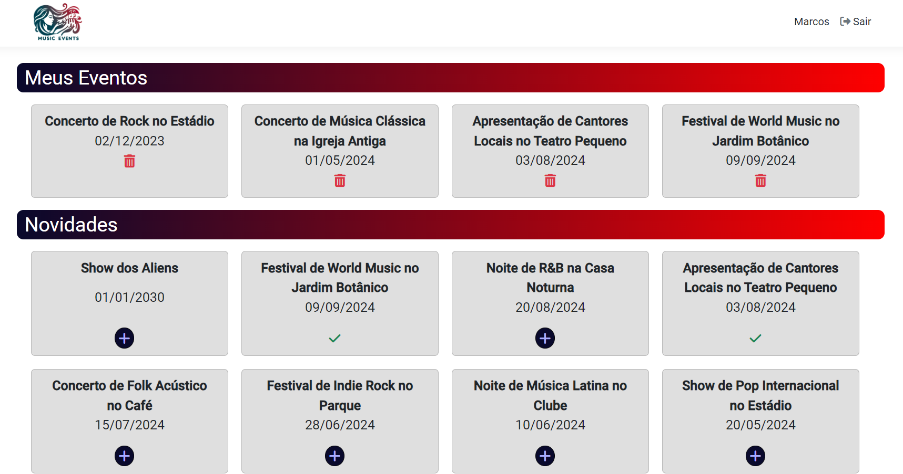
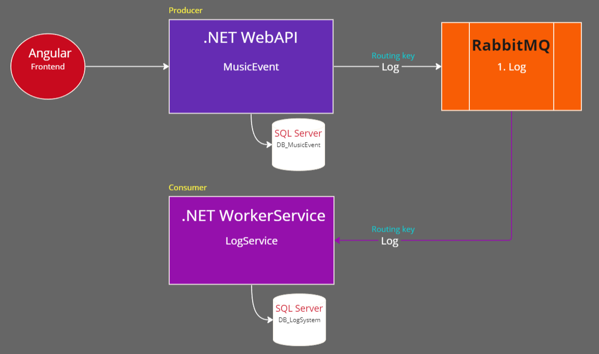

#### [Postech - FIAP - Arquitetura de Sistemas com .NET e Azure]
# MusicEvents

## Sobre
Este é um sistema para divulgação de eventos musicais, onde um usuário ADMINISTRADOR cria os eventos e 
outro usuário CLIENTE faz sua inscrição.

Para a interação com o sistema, ambos os usuários precisam se autenticar através de e-mail e senha.
O usuário CLIENTE pode criar sua conta utilizando a página de cadastro e para um melhor aproveitamento, 
um usuário ADMINISTRADOR já foi previamente cadastrado com as seguintes credenciais. 

E-mail: admin@musicevents.com   
Senha: admin123

# Documentação

* [Requisitos](#requisitos)
    * [Tela de login](#tela-de-login)
    * [Tela de cadastro de usuário](#tela-de-cadastro-de-usuário)
    * [Página inicial do administrador](#página-inicial-do-administrador)
    * [Página inicial do cliente](#página-inicial-do-cliente)
* [Arquitetura](#arquitetura)
* [Como executar o projeto](#como-executar-o-projeto)
    * [Clonar o projeto](#1-clonar-o-projeto)
    * [Restaurar o backup do banco de dados](#2-restaurar-o-backup-do-banco-de-dados)
    * [Executar o RabbitMQ](#3-executar-o-rabbitmq)
    * [Executar o projeto](#4-executar-o-projeto)
* [Tecnologias utilizadas](#tecnologias-utilizadas)

# Requisitos

## Tela de login
Elaborar tela de login para permitir autenticação dos usuários.
### Protótipo

### Critérios de aceite
* O login deverá ser realizado através de e-mail e senha
* Ao tentar entrar com um usuário inexistente, mostrar a mensagem "Acesso negado"
* Ao digitar a senha de forma incorreta, mostrar a mensagem "Usuário ou senha incorretos"
---
## Tela de cadastro de usuário
Elaborar tela de cadastro para permitir o registro de novos usuários.
### Protótipo

### Critérios de aceite
* O formuário deve conter os campos Nome, Idade, E-mail e Senha
* Todos os campos são obrigatórios
* Permitir apenas idade igual ou maior que 18 anos
* A senha deve conter no mínimo 8 caracteres
* Ao clicar no botão Enviar, mostrar a mensagem "Conta criada com sucesso" e voltar para a tela de login
* Ao clicar no botão Cancelar, limpar o formulário e voltar para a tela de login
* Ao clicar no botão Limpar, deve-se reiniciar o formulário
* Os eventos criados deverão estar listados em "Todos os eventos" com o ícone de editar e excluir evento
---
## Página inicial do administrador
Elaborar a página inicial do administrador para que possa criar, editar e excluir eventos.
### Protótipo

### Critérios de aceite
* O menu deve mostrar o nome do Administrador e o botão de Sair da conta
* Deve-se disponibilizar um formulário com os campos Descrição e Data para que o usuário possa cadastrar um evento
* Ao clicar em Criar, o evento precisa ser criado no banco de dados e aparecer instantaneamente na lista de Todos os eventos
* Ao criar um evento, mostrar a mensagem "Evento criado com sucesso!"
---
## Página inicial do cliente
Elaborar a página inicial do cliente para que possa se increver em eventos ou fazer o cancelamento dos mesmos.
### Protótipo

### Critérios de aceite
* O menu deve mostrar o nome do Cliente e o botão de Sair da conta
* Em novidades, serão listados os eventos criados pelo Administrador
* O usuário poderá se inscrever em um evento clicando no botão de "+"
* Ao clicar no botão de inscrição, o evento deverá ser listado em Meus Eventos e exibir a mensagem "Inscrição realizada com sucesso!"
* Ao clicar no ícone de lixeira, o evento deverá ser removido da lista e exibir a mensagem "Inscrição cancelada com sucesso!"
* Ao tentar se inscrever em um evento
---
# Arquitetura
O projeto utiliza uma arquitetura básica de Microsserviços dividindo-se em uma API que controla as funcionalidades da aplicação e um microsserviço que faz o registro de logs, como pode ser observado no seguinte fluxograma. 
Cada microsserviço possui seu próprio banco de dados e ao executar ações como criação de eventos, autenticação, criação de contas, etc, o MusicEvent que atua como "producer" e envia os logs para a fila de mesmo nome presente no RabbitMQ. 
Em seguinda, o microsserviço LogService, que atua como "consumer", está sempre em execução "ouvindo" a fila de logs, assim que os dados chegam, ele retira os logs enfileirados e faz o registro no banco de dados LogSystem.

# Como executar o projeto
### 1. Clonar o projeto
* Para clonar o projeto com o Visual Studio 2022, clique em "Clone a repository", em seguida "GitHub" e entre com as credenciais de sua conta e url do projeto.
* Ao clonar o projeto, deve ser executado o arquivo no diretório "MusicEvent\MusicEvent.sln".

### 2. Restaurar o backup do banco de dados
* Executar o migration da criação do DB no Visual Studio:
   * MusicEvent
      * Clique com o botão direito no projeto MusicEvent.Web e selecione "Set as Startup Project"
      * Acesse "Tools" > "NuGet Package Manager" > "Package Manager Console",
      * Selecione o "Default project: 1. Core\MusicEvent\4.Infrastructure\MusicEvent.Infra.Data" e execute o comando "update-database -context MusicEventContext"
   * LogService
      * Clique com o botão direito no projeto Log.WorkerService e selecione "Set as Startup Project"
      * Acesse "Tools" > "NuGet Package Manager" > "Package Manager Console"
      * Selecione o "Default project: 2. Microsservices\LogService\1. Worker\Log.Infra.Data" e execute o comando "update-database -context LogContext"
* Para restaurar a base criada no SQL Server Management Studio, clique com o botão direito em:
    * "Databases" > "Restore Database...".
    * Selecione o arquivo na pasta "MusicEvent\SQL\DB_MusicEvent.bak" e "MusicEvent\SQL\DB_LogSystem.bak" 

### 3. Executar o RabbitMQ
* Instale o Docker na sua máquina
* Após instalar o Docker, utilize o seguinte comando para baixar e executar o RabbitMQ
    * docker run -p 15672:15672 -p 5672:5672 masstransit/rabbitmq
* Em seguida, abra o navegador e acesse o RabbitMQ através da porta 15672 no endereço http://localhost:15672

* Utilize as credenciais padrão do RabbitMQ para acessar o sistema digitando a palavra "guest" em USERNAME e PASSWORD. Sem aspas!

### 4. Executar o projeto
* Para executar o projeto, clique com o botão direito no projeto web "MusicEvent.Web", selecione "Set as Startup Project" e no botão "executar" na parte superior central, selecione "IIS Express" e clique em executar para carregar a página do Swagger.
* Para executar o Front-End(Angular) utilizando o Visual Studio Code:
    *  Clique em "Open Folder..." e selecione a pasta "MusicEvent\MusicEvent.Web\ClientApp".
    *  Em seguida no terminal do Visual Studio Code, execute o comando "npm install" para baixar os pacotes.
    *  Por fim "ng serve -o" para executar a aplicação e abrir a página de login.

# Tecnologias utilizadas
* .NET 7
* EntityFrameworkCore
* SQL Server
* Angular 15
* RabbitMQ
* Docker
